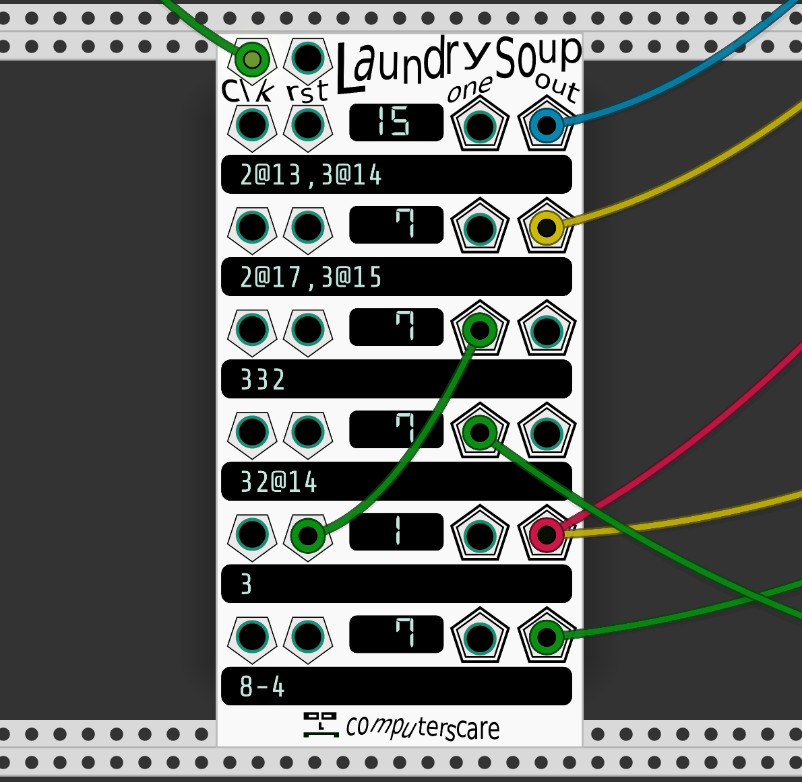

# computerscare modules

Modules for VCV Rack.  I take great pride in the graphic design.

# Laundry Soup
Laundry Soup is a trigger sequencer that takes text as input.  If you connect a clock signal to the "clk" input, and type "1" in the top text box, the top "out" output will send a trigger each clock.  "2" sends a trigger every 2 clock signals.  "31" sends a trigger on the 1st and 4th clock signals, and then repeats this pattern forever or until reset.

### Buttons:
No buttons on Laundry Soup lol!

### Knobs:
Laundry Soup doesn't have any knobs either

### Text Input:
Lets represent a clock signal like this:
`xxxxxxxx`
If the value
`2`
is input into a text field, the output signal will be:
`x-x-x-x-`

### Input Jacks:
**Global Clock (clk):** Increases each row's absoluteStep by 1.

**Global Reset (rst):** Resets each row's absoluteStep to 0.

**Individual Clock (clk):** Increases this row's absoluteStep by 1.  If a cable is plugged in, this row ignores the Global Clock.

**Individual Reset (rst):** Resets this row's absoluteStep to 0.  If a cable is plugged in, this row ignores the Global Reset.

### Output Jacks:

**Individual Row Output (out):** The output of the row's pattern.

**Individual Row First Step Output (one):** Sends a trigger on the 1st step of this row's pattern.

*Inspired by Frank Buss's Formula, Ryan Kirkbride's FoxDot, SuperCollider*

--/-_\-_--\-_/  \ _ -_   \/_ \ -_\\/   /_\\-/-\-_ \\/\ _\\\/\//-/\ __ -___ _-__- --_//_ ----_-\__-_  _-\\-_\/\ _/_\\_\\-_-\- 

## Father & Son Patch Sequencer

If you've ever wished that patch cables could be sequenced, this is the module for you.

Father & Son Patch Sequencer allows for the sequencing of connections.  It's somewhat like a giant sequential switch.

### Buttons:
**Patch Matrix:** Grid of 100 buttons.  When the button is lit in green, it means that the input column and output row is connected for the step that is being edited.  When the button is lit in red, it means that the input column and output row is connected for the currently active step.

**Next Active Step:** Moves to the next active step.  If the sequence length is set to greater than 1, the red lights in the patch matrix will change.

**Reset:** Resets the patch sequencer to step 1.

**Previous/Next Editing Step:** Move to edit the previous or next step.  Note that this will always cycle from 1 to 16 no matter what number of steps the knob is set to.

### Knobs:
**Number of Steps:** Choose between 1 and 16 steps.

### Inputs:
**Clock:** Moves to the next active step.  If the currently active step is equal to the number-of-steps, it will go back to step 1.  Does the same thing as the 'Next Active Step Button'.

**Reset:** Resets the patch sequencer to step 1.  Does the same thing as the 'RST' button.

**Randomize:** Randomizes the patch matrix.  Does the same thing as the 'randomize' selection from the right-click menu.  There are some randomization options available via the right-click menu:

Only Randomize Active Connections: Only input rows/output columns with patch cables connected will be randomized.  Default is un-checked.

Which Step to Randomize: 3 options:

Edit step: The patch matrix for the step that is currently being edited will be randomized

Active step: The patch matrix for the step that is currently active will be randomized

All steps: All patch matrices for all steps will be randomized

**Input Column:** 10 input jacks for any sort of signal you want.

### Outputs:
**Output Row:** 10 output jacks which output the sum of the signals in that particular column.

### Possible applications:

**Triggers:**

**Envelopes / CV:**

**Audio:**

*Inspired by Strum's Patch Matrix, Bidoo's ACnE Mixer, and Fundamental Sequential Switch*

淴淴⊻淴  ⊻ ⊻  淴 淴 淴  淴     淴 淴⊻ 淴⊻淴⊻ ⊻  ⊻ ⊻  淴淴⊻淴  ⊻ ⊻  淴 淴 淴  淴     淴 淴⊻ 淴⊻淴⊻ ⊻  ⊻ ⊻ 

## Debug
A simple module for debugging.  Displays a list of the last 16 voltages read from IN, with the most recent one at the top.

### Inputs:
**Trigger:** When a trigger signal is detected, the voltage at the Input will be placed at the top of the list of voltages, and the voltage at the bottom will be discarded from the display.

**Input:** Any sort of signal you wish to probe.

**Clear:** Reset the list of voltages back to all zeros.

### Buttons:
**Trigger:** Manual Trigger

**Clear:** Manual Clear

