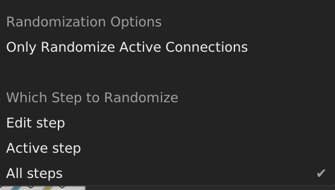

# computerscare modules for VCV Rack

# Oh Peas! Quad Quantenuverter
## 4-Channel attenuverter, offsetter, quantizer

### Text Input:
The scale for quantization is programmed via the text field.  

### Input Jacks:

**Main Input (input):** Increases each row's absoluteStep by 1.

**Range CV (range):** Resets each row's absoluteStep to 0.

**Offset CV (offset):** Increases the row's absoluteStep by 1.  If a cable is plugged in, the row ignores the Global Clock.

### Knobs:
**Number of Divisions (divisions):** How many equal divisions the octave is split into.  Default is 12.

**Transpose:** Amount to add or subtract to final output signal.  Values between -NumDivisions and +NumDivisions, which is equivalent to +/- 1 octave.

**Range CV Attenuverter ("range", small knob):** Attenuverter for the Range CV input.  Scales Range CV between -1 and +1

**Range Knob ("range", large knob):** Attenuverter for Main Input signal.  Scales Main Input between -1 and +1

**Offset CV Attenuverter ("offset", small knob):** Attenuverter for the Range CV input.  Scales Range CV between -1 and +1

**Offset Knob ("offset", large knob):** Constant offset to add after "range" section is applied.  +/- 5 volts.

### Output Jacks:

**Attenuverted, Offset Output (out):** The attenuverted and offset main input signal.  A*(a + B*b) + C*c + d

**Quantized Output (quantized):** The attenuverted and offset main input signal, quantized to the desired scale.

~~~~
ЧxЧ-ፌፌ--   Ч  x䒜-᳹淧ፌ-   -  -淧xx-
 ፌ᳹ 䒜ፌ   x-䒜ፌፌ  ᳹-      ᳹xx   淧 
xx ᳹䒜  淧   -- ፌxЧ -᳹   xxx-x䒜x᳹ 
   淧x- --ፌ᳹xx䒜䒜 䒜 䒜x Ч  -- ᳹x - 
_==-=-=-__==-=-=-__==-=-=-__==-=-=-__==-=-=-_
ЧxЧ-ፌፌ--   Ч  x䒜-᳹淧ፌ-   -  -淧xx-
 ፌ᳹ 䒜ፌ   x-䒜ፌፌ  ᳹-      ᳹xx   淧 
xx ᳹䒜  淧   -- ፌxЧ -᳹   xxx-x䒜x᳹ 
   淧x- --ፌ᳹xx䒜䒜 䒜 䒜x Ч  -- ᳹x - 
~~~~

# I Love Cookies
Signal & CV Sequencer.  Uses Text as input.  Because after all, don't we all love cookies?

Knobs are labeled with lowercase letters: a-z.  Inputs are labeled with uppercase letters A-Z.  Programming in the sequence: ~abcd~ will sequentially output the values of knobs a, b, c, and finally d.  It will then loop back to step 1: knob a again.  An exact voltage can be programmed by enclosing the value in square brackets.  For example: `<4.20>`.  Following a sequence of values (lowercase, uppercase, or exact value) with "@8" will loop the sequence after 8 steps.  8 is not a special value, any number is allowed after the "@" symbol.  Here is an example with some I Love Cookies inputs their equivalents:

~~~~
Input           Equivalent Input

a@3             aaa
ab@5            ababa
<1><0>@8        <1><0><1><0><1><0><1><0>
abcde@8         abcdeabc
abcdef@3        abc
~~~~

## Randomization

Enclosing values (lowercase letter, uppercase letter, or exact voltage) in curly braces {} will randomly select one of the values with equal probability.  For example, ~{ab}~ will choose either "a" or "b" at each clock step.  ~{g<2.55>}~ will output either the value of knob "g" or 2.55 volts with equal probability.

## Square Bracket Expansion

Enclosing comma-separated sequences with square brackets allows for even more complex patterns to be generated.

~~~~
Input           Equivalent Input          Comment

[ab,c]@4        ababcccc                  4 steps of "ab", then 4 steps of "c"
[A,cde]@5       AAAAAcdecd                5 steps from input "A", then 5 steps of "cde"
~~~~

=======

~~~~
Input           Equivalent Input

a@3             aaa
ab@5            ababa
<1><0>@8        <1><0><1><0><1><0><1><0>
abcde@8         abcdeabc
abcdef@3        abc
~~~~

All of the following are valid I Love Cookies programs:
~~~~
<4.20>
{abc}
ab(cd)
def@10
[abc,de]@6
~~~~

~~~~
 ┭ ۳┭┭  ۳۳┭┭ ┭  ┭  ┭┭┭  ┭۳┭۳۳┭
۳  ۳┭ ۳۳۳┭۳  ┭  ┭  ┭ ┭۳  ┭   
┭┭   ┭۳ ┭ ┭ ┭ ┭┭   ۳۳۳┭۳ ۳┭┭  ۳ ┭۳ ۳

 ┭ ۳┭┭  ۳۳┭┭ ┭  ┭  ┭┭┭  ┭۳┭۳۳┭
۳  ۳┭ ۳۳۳┭۳  ┭  ┭  ┭ ┭۳  ┭   
┭┭   ┭۳ ┭ ┭ ┭ ┭┭   ۳۳۳┭۳ ۳┭┭  ۳ ┭۳ ۳

 ┭ ۳┭┭  ۳۳┭┭ ┭  ┭  ┭┭┭  ┭۳┭۳۳┭
۳  ۳┭ ۳۳۳┭۳  ┭  ┭  ┭ ┭۳  ┭   
┭┭   ┭۳ ┭ ┭ ┭ ┭┭   ۳۳۳┭۳ ۳┭┭  ۳ ┭۳ ۳
~~~~

# Laundry Soup
Laundry Soup is a trigger sequencer that takes text as input.  If you connect a clock signal to the "clk" input, and type "1" in the top text box, the top "out" output will send a trigger each clock.  "2" sends a trigger every 2 clock signals.  "31" sends a trigger on the 1st and 4th clock signals, and then repeats this pattern forever or until reset.

### Text Input:
Lets represent a clock signal like this:

`xxxxxxxx`

If the value

`2`

is input into a text field, the output signal will be:

`x-x-x-x-`

You can see this illustrated on the scope in the screenshot above.

The input and output of the 2nd row is:

~~~~
31 ---> x--x  (repeating after 4 beats)
~~~~

In The 3rd row:`2131@8`, the "@8" means: repeat the pattern every 8 clock signals.  In this case the original pattern has length 7 (2 + 1 + 3 + 1 = 7), so normally it would repeat every 7 clock signals.

~~~~
2131   ---> x-xx--x  (repeating after 7 beats)
2131@8 ---> x-xx--xx (repeating after 8 beats)
~~~~
           

A rest can be programmed by using the number "0".  If Laundry Soup is triggered by 16th notes, the pattern `00004` (or equivalently `0@4,4`) can be used to trigger a snare drum sound on the backbeat.
 

~~~~
8      ---> x-------
07     ---> -x------
00004  ---> ----x---
~~~~
 

The 5th row shows how multiple patterns can be combined.  `311@16,2@16` means: `311` for 16 beats, and then `2` for 16 beats.
~~~~
311@16      ---> x--xxx--xxx--xxx
  2@16      --->                 x-x-x-x-x-x-x-x-
   
311@16,2@16 ---> x--xxx--xxx--xxxx-x-x-x-x-x-x-x-
                                                   
[311,2]@16  ---> x--xxx--xxx--xxxx-x-x-x-x-x-x-x-
~~~~

The 6th row shows a way to "skip" beats.  `@4` all by itself means: wait 4 beats with no trigger.  This is another way to generate the backbeat pattern as the 4th row example.
~~~~
@4,4    --->   ----x---
~~~~

### How to program lengths longer than 9 beats:
To program a rhythm that divides the incoming clock by 16, the proper input is NOT `16`.  Values greater than 9 steps must be enclosed in angle brackets `<16>`

~~~~
16      --->   xx-----  (Laundry Soup interprets this as a 1 and then a 6.  This pattern repeats every 7 beats)

<16>    --->   x--------------- (repeats every 16 beats)
~~~~

### Input Jacks:

**Global Clock (clk):** Increases each row's absoluteStep by 1.

**Global Reset (rst):** Resets each row's absoluteStep to 0.

**Individual Clock (clk):** Increases the row's absoluteStep by 1.  If a cable is plugged in, the row ignores the Global Clock.

**Individual Reset (rst):** Resets the row's absoluteStep to 0.  If a cable is plugged in, the row ignores the Global Reset.

### Output Jacks:

**Individual Row Output (out):** The output of the row's pattern.  Outputs 10 volts if:
~~~~
A) The clock signal is sent to the Global Clock or Individual Clock input jack
           AND
B) The pattern ought to trigger on this absoluteStep
~~~~

**Individual Row First Step Output (one):** Sends a trigger on the 1st step of the row's pattern.

### Displays:

The display shows a few things:

*Inspired by Frank Buss's Formula, Ryan Kirkbride's FoxDot, SuperCollider*

~~~~
莅  氊  莅 氊 氊莅氊 氊氊莅莅  莅氊 莅氊
莅 氊氊   氊      莅莅   莅 氊莅  莅
  氊氊  莅 莅氊 氊  莅 氊 氊氊  氊  

莅  氊  莅 氊 氊莅氊 氊氊莅莅  莅氊 莅氊
莅 氊氊   氊      莅莅   莅 氊莅  莅
  氊氊  莅 莅氊 氊  莅 氊 氊氊  氊  

莅  氊  莅 氊 氊莅氊 氊氊莅莅  莅氊 莅氊
莅 氊氊   氊      莅莅   莅 氊莅  莅
  氊氊  莅 莅氊 氊  莅 氊 氊氊  氊    
~~~~    
  
## Father & Son Patch Sequencer

Patch matrix with 16 scenes.  If multiple buttons are active for a single row, the 2 active input signals will be summed.

### Buttons:
**Patch Matrix:** Grid of 100 buttons.  When the button is lit in green, it means that the input column and output row is connected for the step that is being edited.  When the button is lit in red, it means that the input column and output row is connected for the currently active step.

**Clock (clk):** Moves to the next active step.  If the sequence length is set to greater than 1, the red lights in the patch matrix will change.

**Reset (rst):** Resets the patch sequencer to step 1.

**Previous/Next Editing Step (< and >):** Move to edit the previous or next step.  Note that this will always cycle from 1 to 16 no matter what number of steps the knob is set to.

### Knobs:
**Number of Steps:** Choose between 1 and 16 steps.

### Input Jacks:

**Input Column:** 10 input jacks for any sort of signal you want.

**Clock (clk):** Moves to the next active step.  If the currently active step is equal to the number-of-steps, it will go back to step 1.  Does the same thing as the 'Next Active Step Button'.

**Reset (rst):** Resets the patch sequencer to step 1.  Does the same thing as the 'RST' button.

**Randomize (shuf):** Randomizes the patch matrix.  Does the same thing as the 'randomize' selection from the right-click menu.  There are some randomization options available via the right-click menu:

### Randomization Options:

**Only Randomize Active Connections:** Only input rows/output columns with patch cables connected will be randomized.  Default is un-checked.

## Which Step to Randomize (3 options):

**Edit step:** The patch matrix for the step that is currently being edited will be randomized

**Active step:** The patch matrix for the step that is currently active will be randomized

**All steps:** All patch matrices for all steps will be randomized

## Output Row Randomization Method (4 options):

**One or none:** 70% chance that one randomly-selected input button will be enabled

**Exactly one:** Exactly one randomly-selected input button will be enabled

**Zero or more** Each input button has a 20% chance of being enabled

**One or more:** One randomly-selected input button will be enabled, and the rest have a 20% chance each of being enabled

### Output Jacks:

**Output Row:** 10 output jacks which output the sum of the signals in that particular column.

*Inspired by Strum's Patch Matrix, Bidoo's ACnE Mixer, and Fundamental Sequential Switch*

~~~~
ඦ蔩 蔩 ඦ蔩槑ඦඦ        蔩 钧 钧     槑  ඦ
钧   钧钧蔩槑ඦ       ඦ  槑 蔩 蔩猤  
 猤  槑钧猤钧      猤  蔩   ඦ钧     钧

ඦ蔩 蔩 ඦ蔩槑ඦඦ        蔩 钧 钧     槑  ඦ
钧   钧钧蔩槑ඦ       ඦ  槑 蔩 蔩猤  
 猤  槑钧猤钧      猤  蔩   ඦ钧     钧

ඦ蔩 蔩 ඦ蔩槑ඦඦ        蔩 钧 钧     槑  ඦ
钧   钧钧蔩槑ඦ       ඦ  槑 蔩 蔩猤  
 猤  槑钧猤钧      猤  蔩   ඦ钧     钧
~~~~ 

## Debug
A simple module for debugging.  Displays a list of the last 16 voltages read from IN, with the most recent one at the top.

### Inputs:
**Trigger (trg):** When a trigger signal is detected, the voltage at the Input will be placed at the top of the list of voltages, and the voltage at the bottom will be discarded from the display.

**Input (in):** Any sort of signal you wish to probe.

**Clear:** Reset the list of voltages back to all zeros.

### Buttons:
**Trigger (trg):** Manual Trigger

**Clear (clr):** Manual Clear

### Modes of Operation

There are 3 clock modes (single, internal, poly), and 3 input modes (single, internal, poly).  Single uses a single channel.  Poly uses the poly channels.  Internal clock mode operates Debug at audio rate, and Internal input mode uses a uniform random generator with the range selectable via the right-click menu.  The default range for Internal input mode is 0-10v.

**Single Clock, Single Input:**
Selected channel clock signal will place the current value of selected input channel signal at line 1 and will discard the last line in the display.

**Single Clock, Internal Input:**
Internal random generator will replace each of the 16 lines of display

**Single Clock, Poly Input:**
Selected channel clock signal will place current value of each input channel in the corresponding line of the display.  (channel 4 of input gets recorded on line 4 of the display)

**Internal Clock, Single Input:**
"Realtime" updates whichever input channel is selected.  All other output channels remain at their existing values.

**Internal Clock, Internal Input:**
16 channel independent noise source.

**Internal Clock, Poly Input:**
"Realtime" 16-channel poly volt meter

**Poly Clock, Single Input:**
Each clock signal from poly clock input will update the corresponding display/output line with the current value of the selected input channel

**Poly Clock, Internal Input:**
Each clock signal from poly clock will update corresponding display line (a.k.a. output channel) with a random value from the internal generator.

**Poly Clock, Poly Input:**
16-channel sample-and-hold, clocked by poly clock

*Inspired by ML Modules Volt Meter*

~~~~
⼛ೊ ⼛蠍ೊ ೊ  ⼛ೊ蠍ʬ     ⼛
    ʬ    ʬ  蠍⼛     蠍ೊ蠍ʬ蠍⼛ 
 蠍 ⼛ೊ⼛   蠍蠍ೊʬ     蠍  ⼛⼛

⼛ೊ ⼛蠍ೊ ೊ  ⼛ೊ蠍ʬ     ⼛
    ʬ    ʬ  蠍⼛     蠍ೊ蠍ʬ蠍⼛ 
 蠍 ⼛ೊ⼛   蠍蠍ೊʬ     蠍  ⼛⼛

⼛ೊ ⼛蠍ೊ ೊ  ⼛ೊ蠍ʬ     ⼛
    ʬ    ʬ  蠍⼛     蠍ೊ蠍ʬ蠍⼛ 
 蠍 ⼛ೊ⼛   蠍蠍ೊʬ     蠍  ⼛⼛
~~~~
