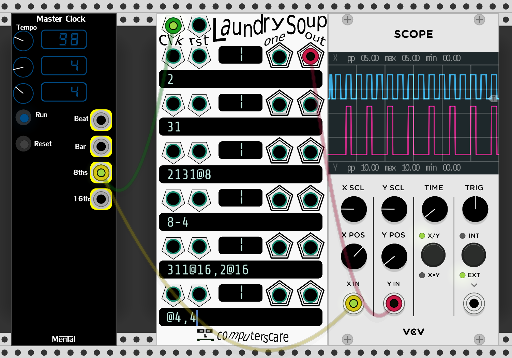
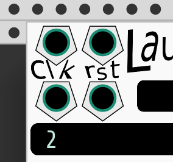

# Laundry Soup
Laundry Soup is a trigger sequencer that takes text as input.  If you connect a clock signal to the "clk" input, and type `1` in the top text box, the top "out" output will send a trigger each clock.  `2` sends a trigger every 2 clock signals.  `31` sends a trigger on the 1st and 4th clock signals, and then repeats this pattern forever or until reset.

### Text Input:
Lets represent a clock signal like this:

`xxxxxxxx`

If the value

`2`

is input into a text field, the output signal will be:

`x-x-x-x-`

You can see this illustrated on the scope in the screenshot above.

The input and output of the 2nd row is:

~~~~
31 ---> x--x  (repeating after 4 beats)
~~~~

In The 3rd row:`2131@8`, the `@8` means: repeat the pattern every 8 clock signals.  In this case the original pattern has length 7 (2 + 1 + 3 + 1 = 7), so normally it would repeat every 7 clock signals.

~~~~
2131   ---> x-xx--x  (repeating after 7 beats)
2131@8 ---> x-xx--xx (repeating after 8 beats)
~~~~
           

A rest can be programmed by using the number "0".  If Laundry Soup is triggered by 16th notes, the pattern `00004` (or equivalently `0@4,4`) can be used to trigger a snare drum sound on the backbeat.
 

~~~~
8      ---> x-------
07     ---> -x------
00004  ---> ----x---
~~~~

Another way to generate the backbeat pattern using the @ symbol:
~~~~
0@4,4    --->   ----x---
~~~~

The 5th row shows how multiple patterns can be combined.  `311@16,2@16` means: `311` for 16 beats, and then `2` for 16 beats.
~~~~
311@16      ---> x--xxx--xxx--xxx
  2@16      --->                 x-x-x-x-x-x-x-x-
   
311@16,2@16 ---> x--xxx--xxx--xxxx-x-x-x-x-x-x-x-
~~~~

The bottom pattern could also be written like this, using square brackets:
~~~~                                                   
[311,2]@16  ---> x--xxx--xxx--xxxx-x-x-x-x-x-x-x-
~~~~

Comma-separated patterns inside square brackets, and followed by an `@` will sequentially output each pattern for the specified number of beats.  For the pattern above, it will output: `311` for 16 beats, and then `2` for 16 beats.

### How to program lengths longer than 9 beats:
To program a rhythm that divides the incoming clock by 16, the proper input is NOT `16`.  Values greater than 9 steps must be enclosed in angle brackets `<16>`

~~~~
16      --->   xx-----  (Laundry Soup interprets this as a 1 and then a 6.  This pattern repeats every 7 beats)

<16>    --->   x--------------- (repeats every 16 beats)
~~~~

### Input Jacks:

**Global Clock (clk):** Increases each row's absoluteStep by 1.

**Global Reset (rst):** Resets each row's absoluteStep to 0.

**Individual Clock (clk):** Increases the row's absoluteStep by 1.  If a cable is plugged in, the row ignores the Global Clock.

**Individual Reset (rst):** Resets the row's absoluteStep to 0.  If a cable is plugged in, the row ignores the Global Reset.

### Output Jacks:

**Individual Row Output (out):** The output of the row's pattern.  Outputs 10 volts if:
~~~~
A) The clock signal is sent to the Global Clock or Individual Clock input jack
           AND
B) The pattern ought to trigger on this absoluteStep
~~~~

**Individual Row EOC Output (eoc):** Sends a trigger on the 1st step of the row's pattern.

### Displays:

The display shows a few things:

- Top row: Which step number the sequence is currently on, starting with 1
- Bottom row: The total length of the pattern
- If the display is red, that means the pattern has a pending change and will switch to the newly typed pattern when it reaches step 1.  ie: changing the pattern is sync'd to the old pattern length.  Click the display to force the pattern to reset on the next clock.

*Inspired by Frank Buss's Formula, Ryan Kirkbride's FoxDot, SuperCollider*

~~~~
莅  氊  莅 氊 氊莅氊 氊氊莅莅  莅氊 莅氊
莅 氊氊   氊      莅莅   莅 氊莅  莅
  氊氊  莅 莅氊 氊  莅 氊 氊氊  氊  

莅  氊  莅 氊 氊莅氊 氊氊莅莅  莅氊 莅氊
莅 氊氊   氊      莅莅   莅 氊莅  莅
  氊氊  莅 莅氊 氊  莅 氊 氊氊  氊  

莅  氊  莅 氊 氊莅氊 氊氊莅莅  莅氊 莅氊
莅 氊氊   氊      莅莅   莅 氊莅  莅
  氊氊  莅 莅氊 氊  莅 氊 氊氊  氊    
~~~~    
  
