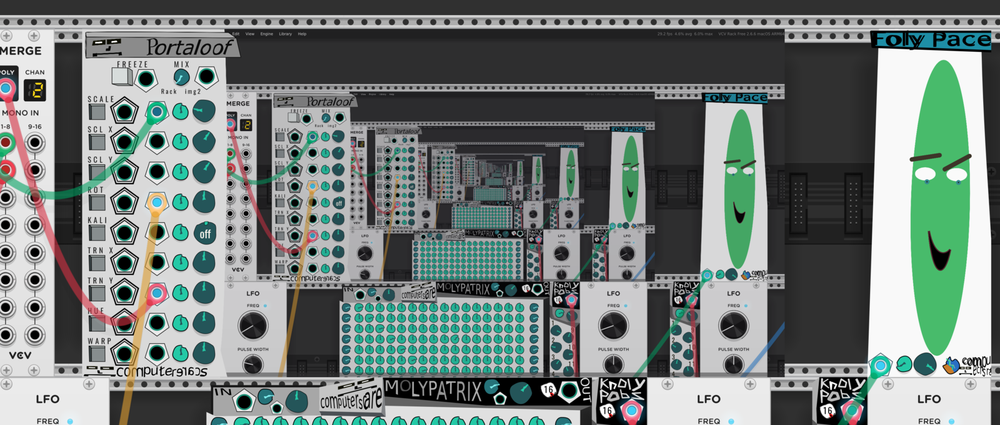
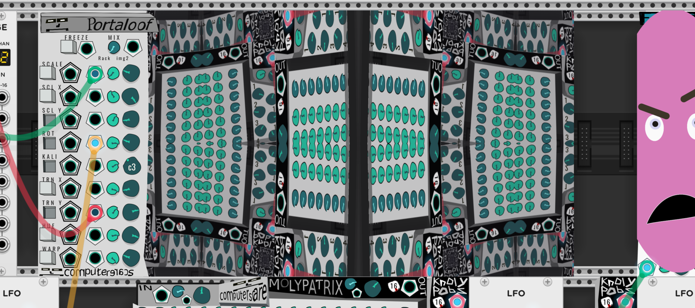
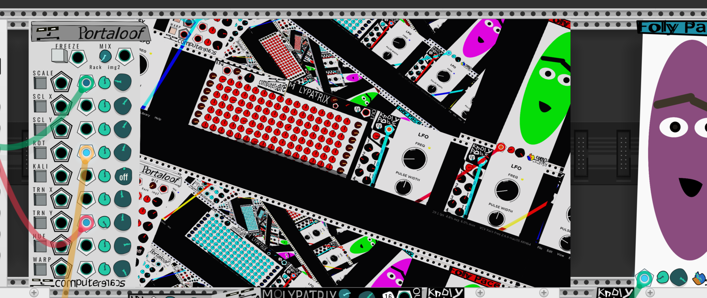
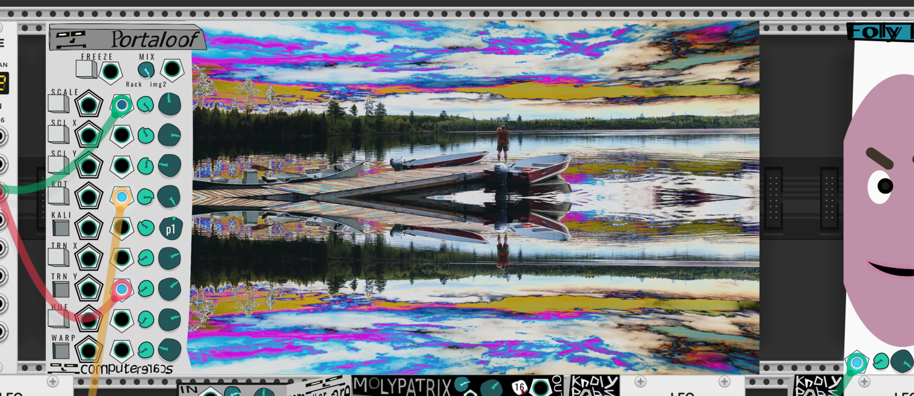
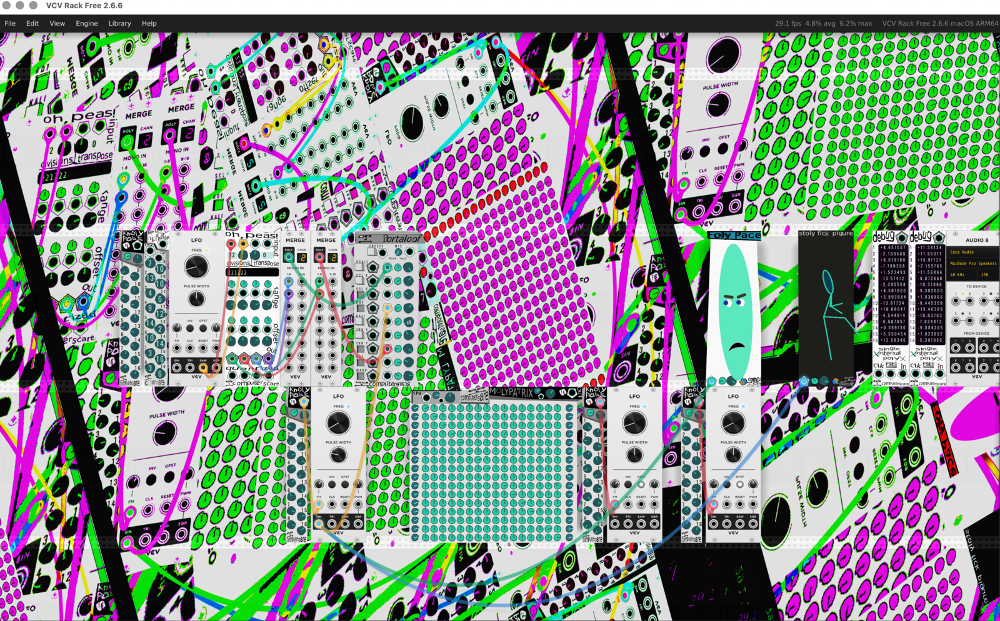

# Portaloof

Portaloof is a real-time visual feedback module. It captures visual sources, blends them, applies geometric and color transforms, then draws the result back into the module display.

The default source is your entire Rack window. The effect is like plugging a video camera into a TV and then pointing the camera at the TV.

The module is resizable by dragging its right edge. Image files (PNG/JPG/JPEG/BMP) can also be dropped directly onto the module.

---

## Header Controls

### FREEZE

- **Button:** Off = continuous capture. On = freeze the current capture.
- **Gate input:** When connected, high voltage (`> 0.5 V`) forces Freeze on and low voltage forces continuous capture. The gate input overrides the button.

When Freeze turns on, Portaloof captures a new frame. With **Transform when frozen** off, the transform settings are captured at that moment. With it on, the frozen frame remains fixed but the knobs and CV continue to transform it live.

### MIX

Blends Source 1 and Source 2.

- `-1`: Source 1 only
- `0`: equal blend
- `+1`: Source 2 only

The Mix CV input adds `CV / 5` to the knob value, then clamps the result to `-1..+1`.

Source 1 defaults to the full Rack window. Source 2 defaults to an image slot, but is silent until an image is loaded or another source is selected. Either source can be the full Rack window, a loaded image, a selected module, a selected rack rectangle, or a selected window rectangle.

---

## Row Controls And CV

Each effect row has:

**toggle button** · **gate input** · **CV input** · **attenuverter** · **value knob**

The gate input overrides the toggle when connected:

- High (`> 0.5 V`) = row on
- Low = row off

The CV input modulates the value knob:

`final = knob + attenuverter * CV * CV scale`

Wrapped rows wrap around their range. Other rows clamp to their range.

| Row | Knob range | CV scale | Final range / behavior |
| --- | --- | --- | --- |
| Scale | `0.1..4.0` | `0.3` per volt | Clamped `0.1..4.0` |
| Scale X | `-5..+5` | `0.5` per volt | Clamped, then mapped exponentially; negative mirrors X |
| Scale Y | `-5..+5` | `0.5` per volt | Clamped, then mapped exponentially; negative mirrors Y |
| Rotation | `-180..+180°` | `36°` per volt | Wrapped `-360..+360°` |
| Kaleido | `-12..+12` | `1.1` per volt | Clamped `-12..+12`, integer steps |
| Translate X | `-1..+1` | `0.1` per volt | Wrapped `-1..+1` |
| Translate Y | `-1..+1` | `0.1` per volt | Wrapped `-1..+1` |
| Hue | `-360..+360°` | `36°` per volt | Wrapped `-360..+360°` |
| Fold Frequency | `0..1` | `0.1` per volt | Clamped `0..1`; right-click slider |
| Color Warp | `-1..+1` | `0.1` per volt | Clamped `-1..+1` |

---

## Geometry Rows

### SCALE

Uniformly zooms the image.

### SCL X / SCL Y

Scale an axis independently. Values near `0..1` give fine control; larger values expand exponentially up to `5x`. Negative values mirror the axis.

Scale, Scale X, and Scale Y multiply together.

### ROT

Rotates the image around the center of the display.

### KALI

Kaleidoscope mode. `0` is off. Positive values are Premium modes, which use flower rotational symmetry. Negative values are Classic modes, which use various 2- or 4-part kaleidoscopes.

### TRN X / TRN Y

Translate the image horizontally or vertically. Values are relative to the image width or display height.

The **Algorithm** right-click option chooses whether translation happens before or after the kaleidoscope:

- **Kaleid > Translate:** kaleidoscope first, then translate
- **Translate > Kaleid:** translate first, then kaleidoscope

---

## Color Rows

### HUE

Positive Hue rotates all colors together around the hue wheel. `0..+360°` is one complete smooth cycle and returns to no change at `+360°`.

Negative Hue uses a stronger cyclic color split. It moves through hue-wheel phases, boosts saturation and color contrast, and adds a smaller chromatic split. It is also cyclic: `0°` and `-360°` are neutral, with the strongest effect around the middle of the negative range.

### COLOR WARP

Applies a nonlinear color/tone transform.

- Positive values: posterize/crush-style contrast shaping
- Negative values: solarize toward inversion; full negative is an inverted image

### Fold Frequency

Fold Frequency lives in the right-click menu rather than on the panel. It scales the color fold frequency from `1.0..4.0` internally and increases chromatic divergence at higher values.

The Fold gate and CV inputs still exist in the hidden row position and still control Fold enable/modulation.

---

## Sources

Portaloof has two mixable sources. Source 1 defaults to the full Rack window. Source 2 defaults to an image source and remains silent until an image is loaded or another source is selected.

Each source can be configured independently from the right-click **Sources** menu.

### Source Options

Each source submenu can select:

- Full Rack Window
- A loaded image
- A specific module
- A rectangle in rack coordinates
- A rectangle in window coordinates

**Clear source** removes that source. Drag-and-drop an image file onto the module to load it into Source 2.

---

## Right-Click Options

### Sources

Configure Source 1 and Source 2 for the Mix control. Each source can be the full Rack window, a loaded image, a selected module, a selected rack rectangle, or a selected window rectangle.

### Fold Frequency

Wide slider for the Fold amount.

### Hide UI

Hides the panel art, controls, labels, and jack graphics. The module shrinks to the display width, keeps the right edge in place, and leaves the resize handle available. Cable anchors are stacked at the bottom-left so existing patch cables continue to route.

### Dim visuals with room

When enabled, Portaloof's visual feedback render follows Rack's room brightness setting. Lower room brightness darkens the generated visuals instead of leaving the screen at full brightness.

### Render as rack background

Renders Portaloof as a rack backdrop behind modules in addition to the module display. This resets to off when the module is initialized.

### Transform when frozen

Controls what happens while Freeze is on:

- Off: transforms are captured when the frame is frozen.
- On: the frozen frame stays fixed, but transform knobs and CV remain live.

### Full Rack BG

Options for rack-background mode.

**Empty module window:** Leaves the module display transparent while the background render is active.

**Backdrop Alpha:** Sets the opacity of the rack-background render.

### Visual

**Tile empty space:** Repeats the image to fill gaps created by rotation, scale, or translation.

**Maintain aspect ratio:** Preserves the source aspect ratio instead of stretching it to the display.

### Algorithm

Chooses the transform order for translate and kaleidoscope:

- **Kaleid > Translate**
- **Translate > Kaleid**
